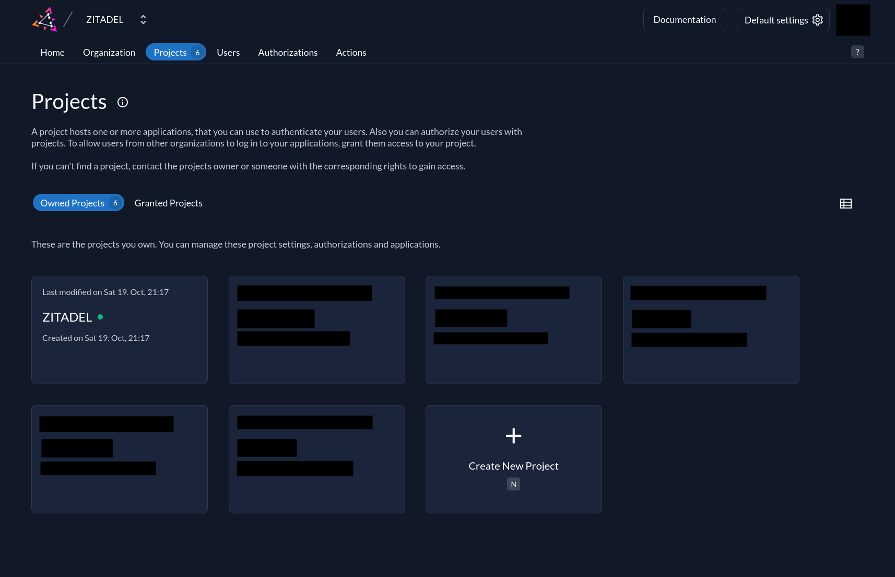
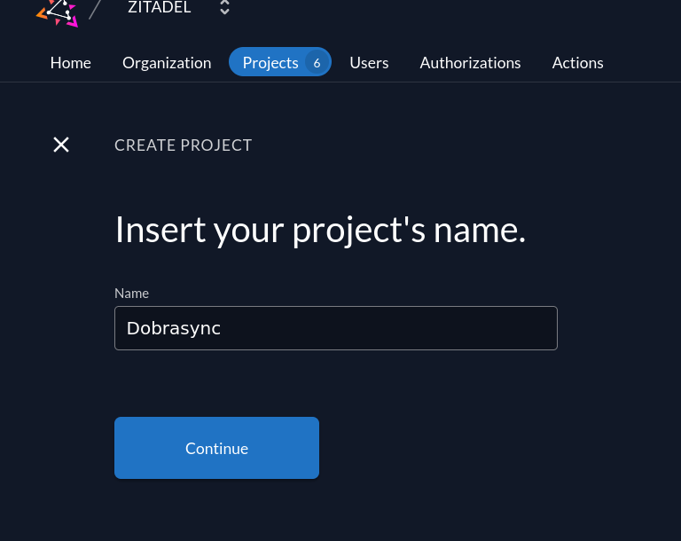
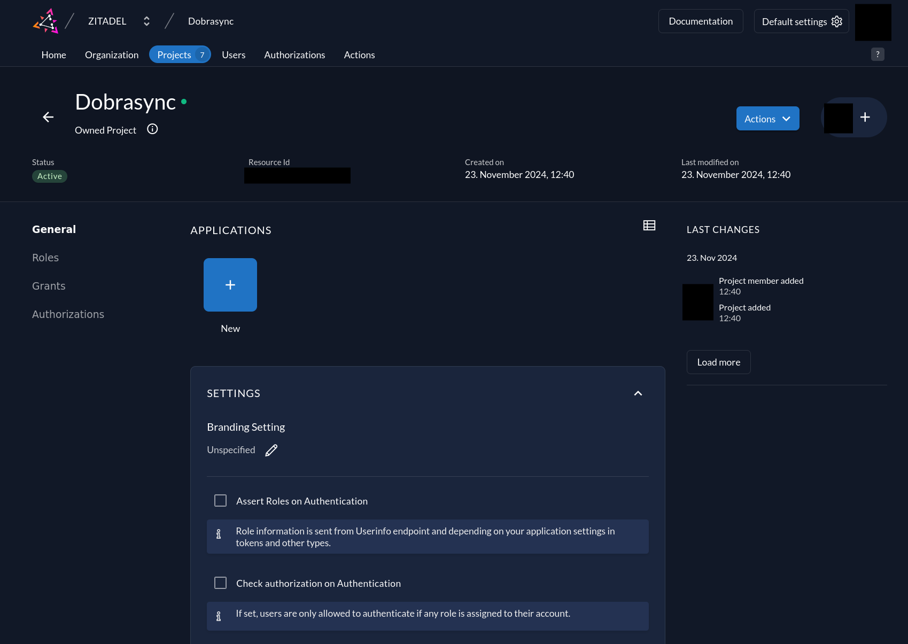
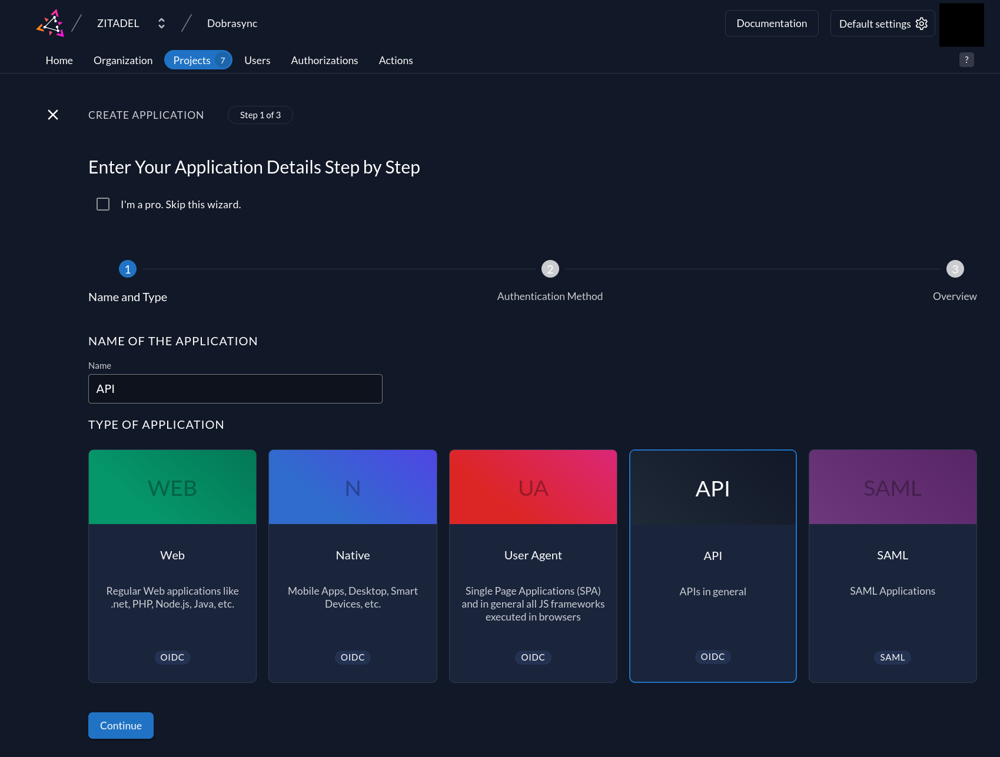
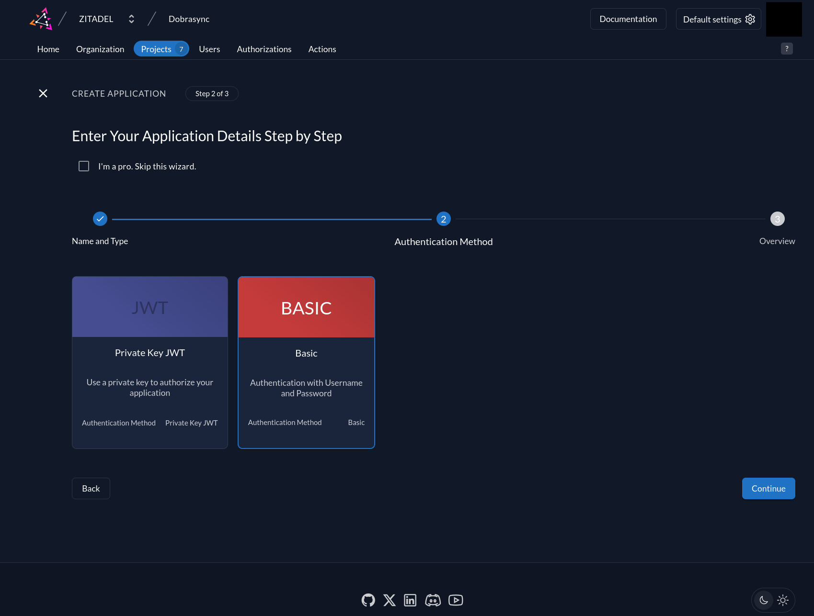
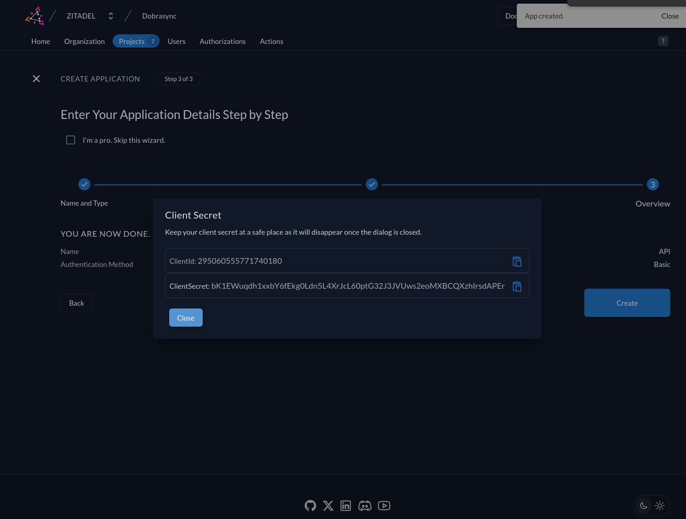
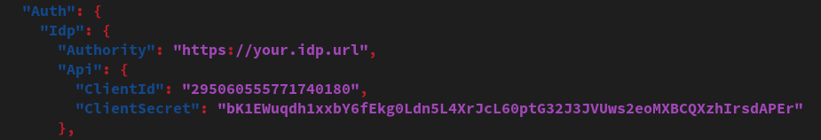

<!-- PROJECT SHIELDS -->
[![Contributors][contributors-shield]][contributors-url]
[![Forks][forks-shield]][forks-url]
[![Stargazers][stars-shield]][stars-url]
[![Issues][issues-shield]][issues-url]
[![GPLv2 License][license-shield]][license-url]

<!-- PROJECT LOGO -->
 

  

  <h3 align="center">API</h3>

  

    Central API handling sync transactions.
     
    <a href="https://github.com/dobrasync/api/docs/user"><strong>Explore the docs »</strong></a>
     
     
    ·
    <a href="https://github.com/Dobrasync/api/issues/new?assignees=&labels=&projects=&template=bug_report.md&title=">Report Bug</a>
    ·
    <a href="https://github.com/Dobrasync/api/issues/new?assignees=&labels=&projects=&template=feature_request.md&title=">Request Feature</a>
  

<!-- GETTING STARTED -->
## Getting Started

### Prerequisites

- Docker

### Installation

#### Using Docker (recommended)

##### Get compose file

You can download a sample `docker-compose.yml` [here](https://github.com/Dobrasync/api/blob/main/docs/docker/docker-compose.yml).

##### Backing up

To persist your data you need to bind the following container dirs and files to the host system:

- In db-service: 
  - `/var/lib/mysql/data`

- In app-service:
  - `/app/appsettings.json`
  - `/libraries`
  - `/tempblocks`

##### Reverse proxy

The API is intended to be proxied through a reverse proxy (for TLS). To do that you just need to pass through port `8080`.

### Configuration

Most of the configuration is changed by editing the `appsettings.json` file.

#### Identity Provider

For security reasons Dobrasync does not handle authentication on its own. Instead, it uses an external identity provider (IdP) like Keycloak, Authentik, Zitadel or similar that supports OpenID-Connect.

You can self-host an IDP or use a hosted solution. That is entirely up to you.

You'll then have to register the Dobrasync API as a new application and insert the Client ID and Client Secret in the `appsettings.json`.

##### Setup in Zitadel

This is an example of how to set up the application with Zitadel:

Sign into the Zitadel console and navigate to `Projects`. Click on `Create new Project`. 

Name it `Dobrasync` and click create.

We'll now go ahead and create the application for the API. Go ahead and click on `New`. Name the application `API`, choose `API` as type of application and click continue.

Choose `Basic` as Authentication Method and continue. 

Check your inputs in the summary and click create if everything is correct. Copy the generated `ClientId` and `ClientSecret` to your APIs appsettings.json.

Now we need to set up another application for device authentication (e.g. for the CLI Client).

To do that, navigate back to the project page and click on `New` to add another app. Name it "Device" and choose "Native" as type of application. Choose "Device Code" as authentication method and continue to creation. Copy the generated `ClientId` to the `appsettings.json` `Device` `ClientId` inside the `Auth.Idp` block.

#### Storage configuration

The API needs a place to store all libraries and temporary blocks. You can specify these directories in the `appsettings.json` `Storage` block. If you are using Docker, it is best to leave these fields alone. 

<!-- USAGE EXAMPLES -->
## Usage

You can connect to the API with Dobrasync clients. More detailed instruction can be found in the in the respective repositories (e.g. [CLI Client](https://github.com/dobrasync/client-cli)).

<!-- REFLINK -->
[contributors-shield]: https://img.shields.io/github/contributors/dobrasync/api.svg?style=for-the-badge
[contributors-url]: https://github.com/dobrasync/api/graphs/contributors
[forks-shield]: https://img.shields.io/github/forks/dobrasync/api.svg?style=for-the-badge
[forks-url]: https://github.com/dobrasync/api/network/members
[stars-shield]: https://img.shields.io/github/stars/dobrasync/api.svg?style=for-the-badge
[stars-url]: https://github.com/dobrasync/api/stargazers
[issues-shield]: https://img.shields.io/github/issues/dobrasync/api.svg?style=for-the-badge
[issues-url]: https://github.com/dobrasync/api/issues
[license-shield]: https://img.shields.io/github/license/dobrasync/api.svg?style=for-the-badge
[license-url]: https://github.com/dobrasync/api/blob/main/LICENSE.txt
